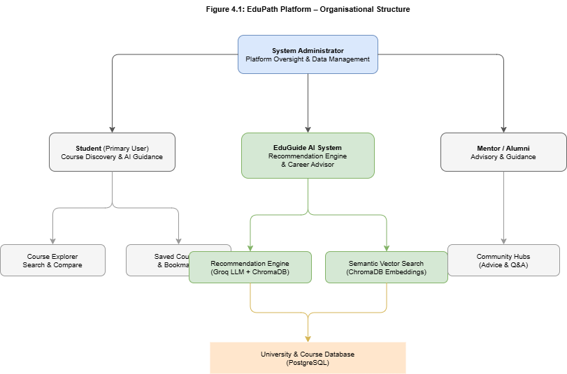
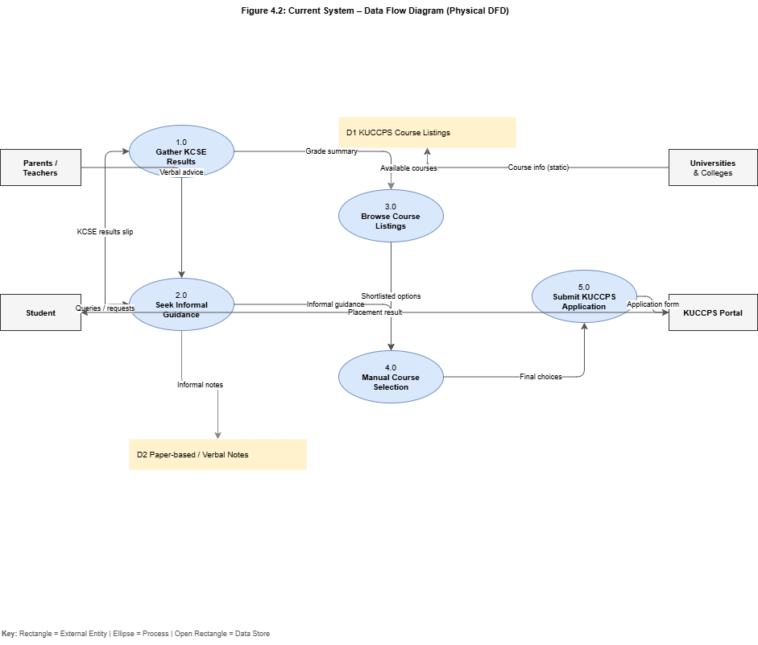
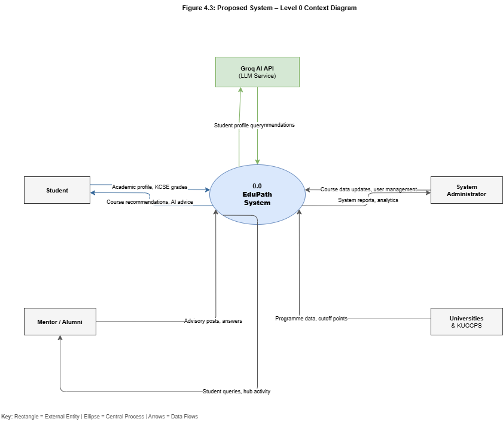
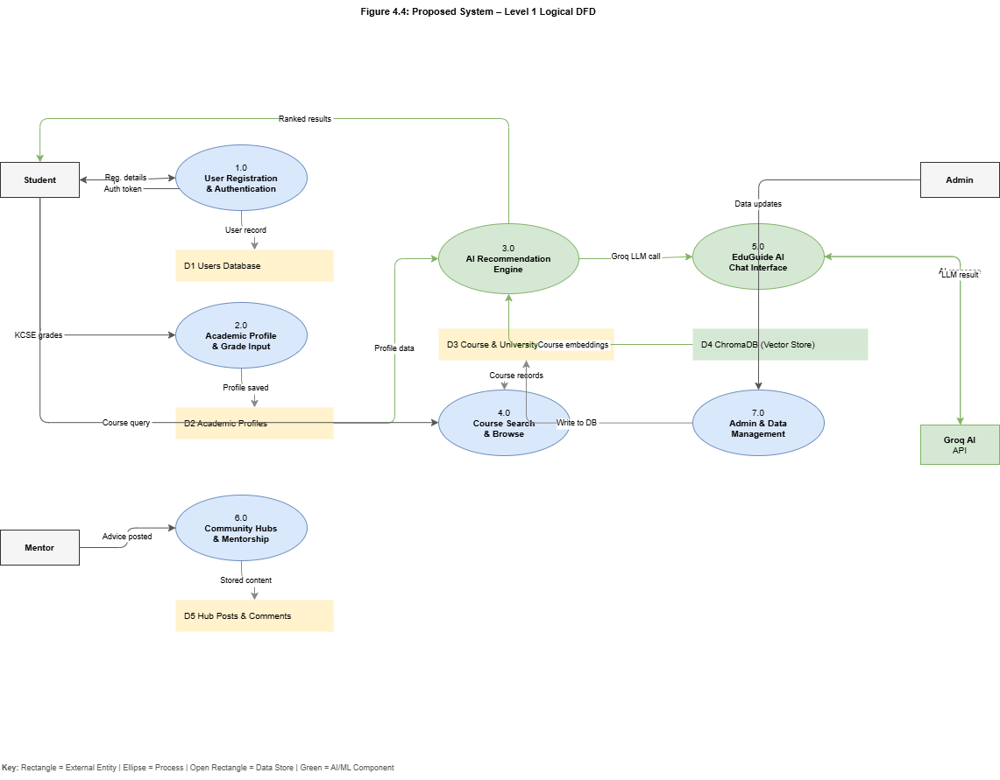
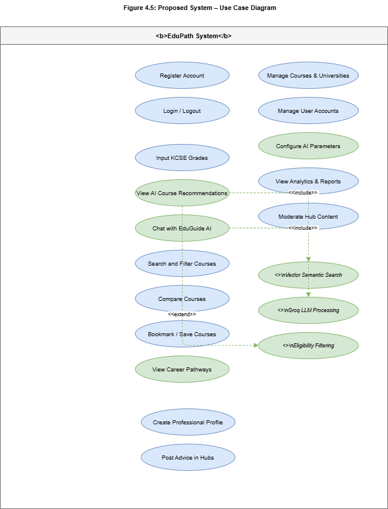
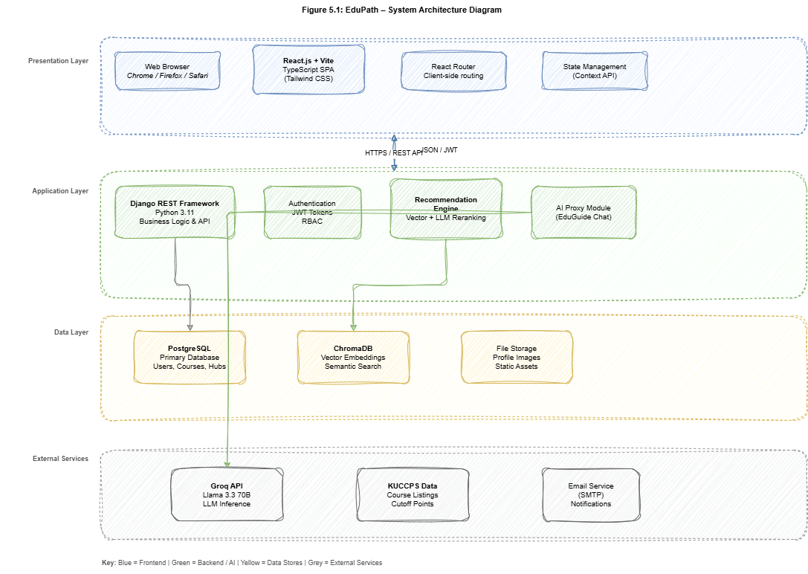
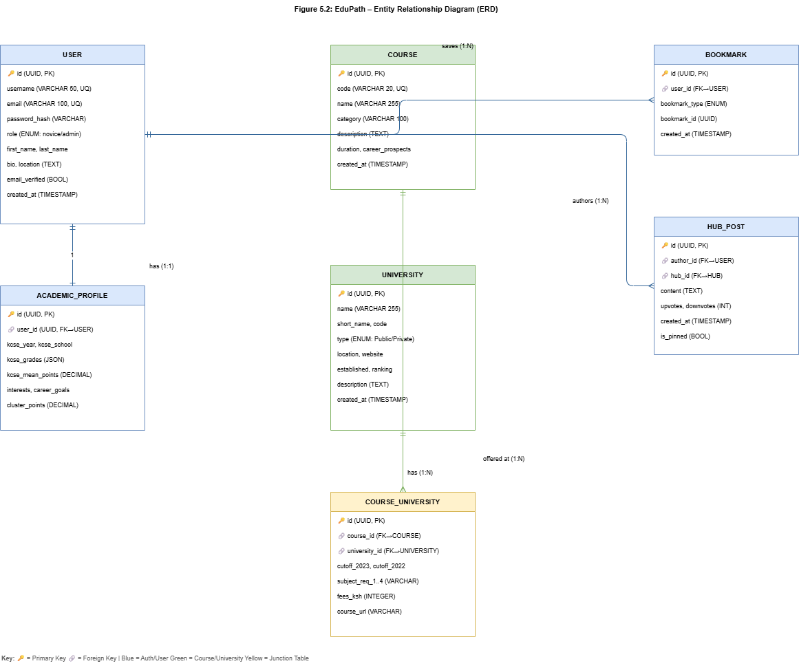

# CHAPTER FOUR: SYSTEM ANALYSIS AND REQUIREMENT MODELING

## 4.1 INTRODUCTION

This chapter presents a comprehensive analysis of the EduPath platform, a career guidance and course selection system designed for Kenyan high school graduates navigating the university admission process. The analysis examines the existing manual process through which students select university courses, identifies its structural weaknesses, and establishes a detailed requirements specification for a modern AI-driven digital replacement. The organisation at the centre of this study is the student-facing segment of the Kenya Universities and Colleges Central Placement Service (KUCCPS) ecosystem, within which thousands of students annually make career-defining decisions with minimal data-driven support.

The chapter proceeds by first documenting the current system's operational structure and known shortcomings, followed by a report on the fact-finding methods employed during requirements gathering. A feasibility assessment evaluates the proposed solution from economic, technical, and operational perspectives. The chapter concludes with a formal specification of system requirements and logical data flow diagrams representing both the existing and proposed systems. Together, these elements provide the analytical foundation upon which the system design in Chapter Five is built.

---

## 4.2 STRUCTURE OF THE ORGANISATION

EduPath operates as a web-based platform within the broader Kenyan secondary-to-tertiary education transition ecosystem. The platform serves multiple stakeholder groups, each interacting with the system in a distinct capacity. The System Administrator maintains overall control of the platform, managing course data, users, and system configuration. The Student is the primary end user, accessing the platform to build an academic profile, receive AI-generated course recommendations, and explore career pathways. The Mentor or Alumni is a verified professional or university student who contributes advisory content through the platform's community features. Educational Institutions, specifically universities and KUCCPS, serve as external data sources whose published course and admission information is ingested into the system's database.

**Figure 4.1: Organisational Structure Diagram**

*See file: `fig4_1_org_structure.drawio`*

---

## 4.3 ANALYSIS OF THE CURRENT SYSTEM

The current course selection process in Kenya is decentralised and largely manual. Upon receiving their KCSE results, students are required to log onto the KUCCPS portal and select up to six course preferences from thousands of available programmes. The portal provides course names, institutional codes, and historical cut-off points but offers no personalised guidance. Students typically supplement this with informal consultations from parents, high school teachers, or peers — sources that, while well-intentioned, frequently lack current and accurate career information. The result is a high rate of uninformed decisions, mismatched course placements, and subsequent academic disengagement.

### 4.3.1 Problems of the Current System

1. **Absence of Personalised Guidance:** The KUCCPS portal treats every student uniformly, providing no mechanism to match individual subject grades and interests to suitable programmes.
2. **Information Fragmentation:** Students must navigate multiple disconnected sources — the KUCCPS portal, individual university websites, career blogs, and verbal advice — with no integration between them.
3. **No Access to AI or Data-Driven Matching:** There is no automated eligibility checking or intelligent ranking of courses against a student's academic profile.
4. **Lack of Mentorship Infrastructure:** Students have no structured access to alumni or professionals who could provide experiential insight into specific programmes or career paths.
5. **Time Pressure and Cognitive Overload:** The application window is short and the volume of available programmes is large, creating decision fatigue and poorly considered choices.

**Figure 4.2: Current System – Data Flow Diagram**

*See file: `fig4_2_current_system_dfd.drawio`*

---

## 4.4 FACT FINDING REPORT

Requirements gathering was conducted using three complementary methods: observation, questionnaire, and document analysis. These methods were chosen to capture both quantitative data and contextual insight.

### a. Method 1: Observation

The researcher conducted direct observation at cyber cafes in Nairobi, Kisumu, and Mombasa during the KUCCPS application phases. Students were observed accessing the portal in groups, often with no prior preparation and heavy reliance on cyber cafe attendants for technical assistance. Key observations included:

- Students spent an average of 20–40 minutes on the portal with no clear selection criteria.
- Most students could not articulate why they selected specific courses beyond "I heard it is good" or "my parent suggested it."
- The KUCCPS interface offered no tooltips, eligibility indicators, or career information.
- Students exhibiting anxiety and confusion were common, particularly those with borderline grade results.
- No student was observed using a systematic approach such as comparing cutoff points against their own grades.

**Finding:** The current system provides no cognitive scaffolding. Students need an intelligent intermediary that pre-filters eligible options and explains each course in plain language.

### b. Method 2: Questionnaire

A structured online questionnaire was distributed to 120 recent KCSE candidates and first-year university students across five counties. Key findings are summarised below:

| Finding | Percentage |
|---|---|
| Found it difficult to interpret grades against course requirements | 85% |
| Lacked adequate career guidance before application | 72% |
| Relied on parents or peers as primary information source | 60% |
| Wanted an automated AI course matching tool | 95% |
| Wanted an AI assistant to explain career paths | 84% |
| Preferred a mobile-first web application | 100% |
| Felt that access to a mentor or alumni would have increased confidence | 88% |

**Finding:** There is strong demand for an AI-powered, mobile-accessible career guidance platform. Students are specifically seeking automated matching and conversational AI assistance — not simply a digital replica of the current portal.

### c. Method 3: Document Analysis

The researcher analysed the KUCCPS portal, third-party academic advisory platforms (Masomo, Brighter Monday, international platforms such as Naviance), and published academic research on career guidance systems in Sub-Saharan Africa. Key findings:

- The KUCCPS portal is transactional by design and does not include advisory features.
- Third-party platforms are Western-centric and do not model the KCSE grading system, Kenyan subject clusters, or local university admission criteria.
- Academic literature identifies AI-based recommendation systems as significantly more effective than static portal searches in improving course-fit outcomes.
- No existing Kenyan platform combines AI-driven matching with mentorship, community features, and local data.

**Finding:** A gap exists in the Kenyan market for a localised, AI-powered system that bridges raw KUCCPS data with intelligent personalisation and community mentorship.

---

## 4.5 FEASIBILITY STUDY

### a) Economic Feasibility

EduPath is built entirely on open-source technologies — React.js, Django, and PostgreSQL — eliminating software licensing costs. AI inference is handled via the Groq API, which provides state-of-the-art LLM performance at significantly lower cost than alternatives such as OpenAI GPT-4. Estimated annual operational costs for an early-stage deployment are between KES 33,000 and KES 55,000 (cloud hosting, AI API credits, domain, and SSL). The platform can achieve financial sustainability through institutional partnerships with universities, premium advisory features, or KUCCPS-affiliated data licensing. The cost-to-benefit ratio is highly favourable given the scale of the target audience (over 100,000 KCSE candidates annually).

### b) Technical Feasibility

The proposed system is technically achievable using the developer's existing skill set and publicly available tools. The frontend (React.js + TypeScript) and backend (Django REST Framework) are industry-standard, mature frameworks with extensive documentation. AI integration via the Groq API uses a standard REST interface. Semantic search using ChromaDB is well-supported in Python and requires no specialised infrastructure. All components can be deployed on standard cloud hosting (e.g., DigitalOcean, AWS, or Render). No experimental or unproven technologies are required at any stage.

### c) Operational Feasibility

The platform's interface follows UX conventions familiar to Gen Z users — card-based navigation, chat interfaces, and social feed layouts — reducing the learning curve to near zero. The system is mobile-first, consistent with the fact that 100% of surveyed users identified smartphones as their primary device. The AI chatbot operates conversationally, removing the need for users to understand query syntax or database structure. System administration is handled through a dedicated admin dashboard with role-based access control, allowing non-technical staff to manage course data and user accounts. The system requires no organisational restructuring to adopt.

---

## 4.6 THE PROPOSED SYSTEM

### 4.6.1 Requirements of the Proposed System

#### a. User Requirements

i. Students must be able to input their KCSE subject grades and receive a personalised list of eligible university programmes ranked by match quality.
ii. Students must be able to converse with an AI career advisor (EduGuide) that answers questions about courses, career paths, and subject requirements in plain English or Swahili.
iii. Students must be able to search, filter, compare, and bookmark courses across all Kenyan universities in a single interface.

#### b. Business Requirements

i. The system must securely store student academic data and comply with Kenya's Data Protection Act (2019), including encrypted storage and restricted access controls.
ii. The platform must support ongoing updates to course and university data to ensure alignment with annual KUCCPS publications.
iii. Usage analytics must be captured to support institutional reporting and demonstrate platform impact to potential partners.

#### c. Functional Requirements

i. **AI Recommendation Engine:** The system must accept a student's KCSE grade profile, perform a semantic vector search against course embeddings stored in ChromaDB, apply eligibility filtering, and return a ranked list of the top recommended programmes with AI-generated explanations.
ii. **EduGuide AI Chat:** The system must provide a conversational AI interface powered by Groq's Llama 3.3 70B model, capable of conducting adaptive career guidance interviews and answering course-specific queries.
iii. **Course and University Management:** Administrators must be able to perform full CRUD operations on course, university, and programme records through a dedicated admin dashboard.
iv. **User Profile and Academic Data Management:** Students must be able to create and update their academic profiles, including KCSE subject grades, career interests, and personal information.
v. **Course Comparison and Bookmarking:** Students must be able to compare up to three courses side-by-side and save courses to a personal shortlist.

#### d. Non-Functional Requirements

i. **Performance:** The recommendation engine must return results within 3 seconds. Standard page loads must not exceed 2 seconds on a 4G connection.
ii. **Security:** All API endpoints must be protected by JWT-based authentication. Passwords must be hashed using bcrypt. The system must be protected against common web vulnerabilities including SQL injection, XSS, and CSRF.
iii. **Scalability:** The architecture must support horizontal scaling to handle peak traffic during KCSE results release periods, when concurrent usage may spike to 10,000+ users.
iv. **Usability:** The interface must be fully responsive across mobile, tablet, and desktop screen sizes, and must meet WCAG 2.1 AA accessibility standards.

---

## 4.7 DATA FLOW DIAGRAMS

### Proposed System Context Diagram (Level 0 DFD)

The Level 0 context diagram treats the entire EduPath system as a single process and illustrates all external entities that interact with it and the data flows between them. The primary external entities are the Student, Mentor/Alumni, System Administrator, Universities/KUCCPS, and the Groq AI API. The student submits an academic profile and receives AI recommendations in return. The administrator manages data and receives system reports. The Groq API processes natural language queries and returns ranked recommendations.

**Figure 4.3: Proposed System – Level 0 Context Diagram**

*See file: `fig4_3_context_diagram.drawio`*

### Proposed System Logical DFD (Level 1)

The Level 1 DFD decomposes the EduPath system into seven functional processes: User Registration and Authentication (P1.0), Academic Profile and Grade Input (P2.0), AI Recommendation Engine (P3.0), Course Search and Browse (P4.0), EduGuide AI Chat Interface (P5.0), Community Hubs and Mentorship (P6.0), and Admin and Data Management (P7.0). Each process interacts with one or more data stores including the Users Database (D1), Academic Profiles (D2), Course and University Database (D3), ChromaDB Vector Store (D4), and Hub Posts and Comments (D5).

**Figure 4.4: Proposed System – Level 1 Logical DFD**

*See file: `fig4_4_level1_dfd.drawio`*

### Proposed System Use Case Diagram

The use case diagram identifies all actions that each actor class can perform within the system. The Student actor has the richest set of use cases, including AI-driven interactions. The AI recommendation and chat use cases include explicit `<<include>>` relationships with underlying AI sub-processes (Vector Semantic Search, Groq LLM Processing) and an `<<extend>>` relationship with Eligibility Filtering, indicating that eligibility checking conditionally extends the core recommendation flow.

**Figure 4.5: Proposed System – Use Case Diagram**

*See file: `fig4_5_use_case.drawio`*

---
---

# CHAPTER FIVE: SYSTEM DESIGN

## 5.1 INTRODUCTION

This chapter translates the requirements established in Chapter Four into a concrete technical blueprint for the EduPath platform. System design defines the architecture, data structures, process flows, and interface layouts that will guide implementation. The design is governed by three core principles: performance, ensuring that AI-driven features respond within acceptable time thresholds; security, protecting sensitive academic data through industry-standard authentication and encryption; and usability, producing an interface that is immediately accessible to high school graduates without prior training.

The chapter begins with the system's high-level architecture, progresses through detailed process models for core AI and user flows, presents a relational database schema, and concludes with user interface design specifications covering navigation, input design, and output design. Screenshot placeholders are provided for the interface section and will be replaced with actual screenshots from the deployed system.

---

## 5.2 ARCHITECTURE OF THE PROPOSED SYSTEM

EduPath adopts a decoupled client-server architecture in which the frontend and backend are developed and deployed independently and communicate exclusively through a versioned RESTful API. This approach enables the frontend to be served as a static Single Page Application (SPA) via a CDN while the backend scales independently to handle computational loads from AI inference and database queries.

The architecture is organised into four layers:

**Presentation Layer** — A React.js 18 SPA built with Vite and TypeScript. The frontend is responsible for rendering UI components, managing client-side routing (React Router), and consuming backend data via authenticated HTTP requests. Styling is handled by Tailwind CSS with shadcn/ui components.

**Application Layer** — A Django 5.0 REST API using Django REST Framework. This layer implements all business logic including user authentication (JWT), academic profile processing, AI query orchestration, and CRUD operations for admin functions. It acts as the secure intermediary between the frontend and both the database and external AI services.

**Data Layer** — A PostgreSQL 15 relational database stores all persistent application data. ChromaDB operates as a local vector store, holding pre-computed embeddings of course descriptions for semantic similarity search.

**External Services Layer** — The Groq API provides LLM inference via the Llama 3.3 70B Versatile model. KUCCPS course data is imported into PostgreSQL during system setup and updated annually by the administrator.

**Figure 5.1: System Architecture Diagram**

*See file: `fig5_1_system_architecture.drawio`*

### Technology Stack Summary

| Layer | Technology | Justification |
|---|---|---|
| Frontend | React.js 18 + TypeScript (Vite) | Component reusability, type safety, fast build |
| Styling | Tailwind CSS + shadcn/ui | Rapid, consistent, mobile-first UI |
| Backend | Django 5.0 + Django REST Framework | Mature, batteries-included, strong ORM |
| Database | PostgreSQL 15 | ACID compliance, relational integrity |
| Vector Store | ChromaDB | Local, fast semantic search, Python-native |
| AI Inference | Groq API (Llama 3.3 70B) | Low-latency LLM, cost-effective |
| Authentication | JWT (djangorestframework-simplejwt) | Stateless, scalable, industry standard |

---

## 5.3 SYSTEM PROCESS DIAGRAMS

### 5.3.1 AI Course Recommendation Process

This is the central process of the EduPath system. It begins when a student submits or updates their academic profile and triggers the recommendation engine.

**Process Flow:**
1. Student submits KCSE grade data via the frontend.
2. The backend's Academic Profile service stores the grades in PostgreSQL and derives aggregate and cluster points.
3. The Recommendation Engine converts the student profile into a natural language summary (e.g., "Student with A in Mathematics, B+ in Physics, C+ in Chemistry, targeting Engineering").
4. The summary is embedded into a vector and queried against ChromaDB to retrieve the top 50 semantically similar course descriptions.
5. A hard eligibility filter is applied, removing any course whose cutoff exceeds the student's computed points.
6. The filtered list is sent to the Groq API (Llama 3.3 70B) with a reranking prompt. The model returns the top 5 courses with personalised explanations in plain language.
7. Results are returned to the frontend and displayed as recommendation cards with match reasoning.

### 5.3.2 EduGuide AI Chat Process

1. The student opens the EduGuide chat interface and types a natural language query (e.g., "What courses suit a student who got a B+ in Biology and wants to work in health?").
2. The frontend sends the message and the student's profile context to the backend's AI proxy endpoint.
3. The backend appends a system prompt containing the student's academic profile and a knowledge base of Kenyan KUCCPS courses.
4. The assembled prompt is forwarded to the Groq API.
5. The API returns a structured, conversational response with course suggestions, career explanations, and subject requirement clarifications.
6. The response is streamed to the frontend and displayed in the chat interface with source citations where relevant.

### 5.3.3 User Registration and Academic Profile Setup

1. The user submits the registration form with email, username, and password.
2. The backend validates inputs, checks for email uniqueness, hashes the password (bcrypt, 12 rounds), and creates the user record.
3. A JWT access token and refresh token are issued and returned to the frontend.
4. The frontend redirects to the profile wizard, where the user enters KCSE subject grades via a structured grid input.
5. The backend computes mean grade, aggregate points, and cluster points from the submitted grades and stores them in the AcademicProfile table.
6. Upon profile completion, the Recommendation Engine runs automatically and the dashboard is populated with initial course recommendations.

---

## 5.4 DATABASE DESIGN, STRUCTURE AND TABLES

The database follows Third Normal Form (3NF) to eliminate data redundancy and enforce referential integrity. All primary keys use UUID data types to prevent enumeration attacks and support distributed deployment.

**Figure 5.2: Entity Relationship Diagram**

*See file: `fig5_2_erd.drawio`*

### 5.4.1 Data Dictionary

**Table 5.1 – USER**

| Field | Type | Constraint | Description |
|---|---|---|---|
| id | UUID | PK | Unique user identifier |
| username | VARCHAR(50) | UNIQUE, NOT NULL | Display name |
| email | VARCHAR(100) | UNIQUE, NOT NULL | Login credential |
| password_hash | VARCHAR(255) | NOT NULL | bcrypt hashed password |
| role | ENUM | NOT NULL, DEFAULT 'novice' | novice / contributor / expert / admin |
| first_name, last_name | VARCHAR(50) | NULLABLE | User's full name |
| bio | TEXT | NULLABLE | Personal statement |
| location | VARCHAR(100) | NULLABLE | Geographic location |
| email_verified | BOOLEAN | DEFAULT FALSE | Verification status |
| created_at | TIMESTAMP | DEFAULT NOW() | Registration date |

**Table 5.2 – ACADEMIC_PROFILE**

| Field | Type | Constraint | Description |
|---|---|---|---|
| id | UUID | PK | Unique profile identifier |
| user_id | UUID | FK → USER, UNIQUE | One-to-one with User |
| kcse_year | INTEGER | NULLABLE | Year of examination |
| kcse_school | VARCHAR(255) | NULLABLE | High school attended |
| kcse_grades | JSON | NULLABLE | e.g. {"mathematics": "A", "english": "B+"} |
| kcse_mean_points | DECIMAL(5,2) | NULLABLE | Computed aggregate |
| cluster_points | DECIMAL(5,2) | NULLABLE | Subject cluster aggregate |
| interests | JSON | DEFAULT [] | Career interest tags |
| career_goals | TEXT | NULLABLE | Stated goals |

**Table 5.3 – COURSE**

| Field | Type | Constraint | Description |
|---|---|---|---|
| id | UUID | PK | Unique course identifier |
| code | VARCHAR(20) | UNIQUE | Official KUCCPS code |
| name | VARCHAR(255) | NOT NULL | Programme name |
| category | VARCHAR(100) | NOT NULL | Academic category |
| description | TEXT | NULLABLE | Course overview |
| duration | VARCHAR(50) | NULLABLE | e.g. "4 years" |
| career_prospects | TEXT | NULLABLE | Graduate career paths |

**Table 5.4 – UNIVERSITY**

| Field | Type | Constraint | Description |
|---|---|---|---|
| id | UUID | PK | Unique institution identifier |
| name | VARCHAR(255) | NOT NULL | Institution full name |
| short_name | VARCHAR(50) | NULLABLE | Abbreviation (e.g. UON, KU) |
| type | ENUM | NOT NULL | Public / Private |
| location | VARCHAR(100) | NULLABLE | Campus location |
| website | VARCHAR(255) | NULLABLE | Official URL |
| ranking | INTEGER | NULLABLE | National ranking |

**Table 5.5 – COURSE_UNIVERSITY (Pivot)**

| Field | Type | Constraint | Description |
|---|---|---|---|
| id | UUID | PK | Unique pivot identifier |
| course_id | UUID | FK → COURSE | Reference to course |
| university_id | UUID | FK → UNIVERSITY | Reference to university |
| cutoff_2023 | DECIMAL(5,3) | NULLABLE | 2023 admission cutoff |
| cutoff_2022 | DECIMAL(5,3) | NULLABLE | 2022 admission cutoff |
| subject_req_1..4 | VARCHAR(255) | NULLABLE | Mandatory subject requirements |
| fees_ksh | INTEGER | NULLABLE | Annual tuition in KES |
| course_url | VARCHAR(500) | NULLABLE | Programme page URL |

**Table 5.6 – BOOKMARK**

| Field | Type | Constraint | Description |
|---|---|---|---|
| id | UUID | PK | Unique bookmark identifier |
| user_id | UUID | FK → USER | Bookmarking user |
| bookmark_type | ENUM | NOT NULL | course / university / post |
| bookmark_id | UUID | NOT NULL | ID of bookmarked item |
| created_at | TIMESTAMP | DEFAULT NOW() | Saved date |

**Table 5.7 – HUB_POST**

| Field | Type | Constraint | Description |
|---|---|---|---|
| id | UUID | PK | Unique post identifier |
| hub_id | UUID | FK → HUB | Parent community |
| author_id | UUID | FK → USER | Post author |
| content | TEXT | NOT NULL | Post body |
| upvotes | INTEGER | DEFAULT 0 | Upvote count |
| is_pinned | BOOLEAN | DEFAULT FALSE | Pinned status |
| created_at | TIMESTAMP | DEFAULT NOW() | Post date |

### 5.4.2 Entity Relationships Summary

- **USER (1) → (1) ACADEMIC_PROFILE** — Each user has exactly one academic profile.
- **COURSE (1) → (N) COURSE_UNIVERSITY ← (1) UNIVERSITY** — Many-to-many relationship resolved through the pivot table, which holds cutoff points, fees, and subject requirements specific to each combination.
- **USER (1) → (N) BOOKMARK** — A user can save multiple courses or universities.
- **USER (1) → (N) HUB_POST** — A user can author multiple posts across different Hubs.

---

## 5.5 USER INTERFACE DESIGN

### 5.5.1 Navigation Design

The platform uses persistent sidebar navigation on desktop and a bottom tab bar on mobile, consistent with the conventions of social and productivity applications familiar to the target user base.

**Desktop Sidebar Navigation:**
- Dashboard
- Explore Courses
- AI Recommendations
- EduGuide (AI Chat)
- My Saved Courses
- Community Hubs
- Profile / Settings

**Mobile Bottom Navigation:**
- Home | Explore | EduGuide | Hubs | Profile

### 5.5.2 Input Design

**KCSE Grade Input:** A structured grid displays all KCSE subjects with dropdown selectors for each grade (A through E). Aggregate and mean grade values update in real time as grades are entered, providing immediate feedback.

**EduGuide AI Chat Input:** A text input field at the bottom of the chat interface, styled consistently with messaging applications. Suggested prompt chips (e.g., "What can I study with a B+ in Biology?") are displayed above the input to lower the barrier for first-time users.

**Course Search and Filter:** A search bar with real-time autocomplete is paired with collapsible filter panels for category, university type, location, and cutoff range.

### 5.5.3 Output Design

**Recommendation Cards:** Each recommended course is displayed as a card containing the course name, university, match score (percentage), AI-generated explanation paragraph, key requirements summary, and action buttons (View Details, Compare, Save).

**Course Detail View:** A tabbed detail page displaying description, subject requirements (highlighted as badges), cutoff history (2022/2023), annual fees, career prospects, and a list of all universities offering the programme with individual cutoffs.

**EduGuide Chat Output:** AI responses are streamed character-by-character into chat bubbles, with course names rendered as tappable links that navigate to the course detail view.

### 5.5.4 Interface Screenshots

*The following placeholders will be replaced with actual screenshots from the deployed system:*

**Figure 5.3:** EduPath Dashboard — Personalised recommendation feed
*(Screenshot placeholder — to be added post-deployment)*

**Figure 5.4:** EduGuide AI Chat Interface
*(Screenshot placeholder — to be added post-deployment)*

**Figure 5.5:** Course Explorer — Search and filter view
*(Screenshot placeholder — to be added post-deployment)*

**Figure 5.6:** Course Detail Page — Tabbed information layout
*(Screenshot placeholder — to be added post-deployment)*

**Figure 5.7:** Admin Dashboard — Course and university management
*(Screenshot placeholder — to be added post-deployment)*

---

*End of Chapter Four and Chapter Five*
